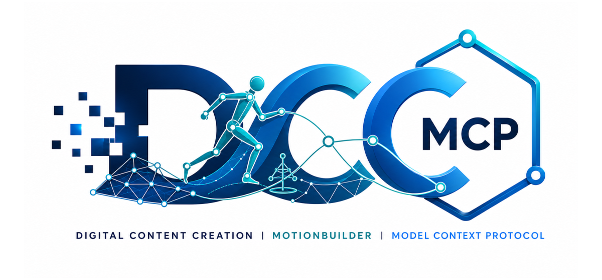

# dcc-mcp-mobu

<p align="center">
  
</p>

## Agent workflow

AI agents should use the shared gateway through `dcc-mcp-cli`; IDE users may
continue to use the MCP endpoint. Prefer typed skills and tools over raw scripts.

```bash
dcc-mcp-cli dcc-types
dcc-mcp-cli list
dcc-mcp-cli search --query "<task>" --dcc-type mobu
dcc-mcp-cli describe <tool-slug>
dcc-mcp-cli call <tool-slug> --json '{"key":"value"}'
```

`dcc-types` reports release-catalog support; `list` reports live sessions. If a
tool belongs to an inactive progressive skill, call `dcc-mcp-cli load-skill <skill-name> --dcc-type mobu` before retrying. For post-task improvement,
attach a stable session id with `--meta-json`, query `dcc-mcp-cli stats --range 24h --session-id <task-id>`, then pass the bounded evidence to the
`review_skill_improvement` prompt from `dcc-mcp-skills-creator`.


An MCP adapter for Autodesk MotionBuilder, built on [dcc-mcp-core](https://github.com/dcc-mcp/dcc-mcp-core).

It exposes a small, typed scene-management surface and runs MotionBuilder API calls on the application's UI thread.

## Install

```bash
pip install dcc-mcp-mobu
```

Copy the installed `dcc_mcp_mobu/mobu_plugin/startup/dcc_mcp_mobu.py` into a MotionBuilder Python Startup directory, or add that directory to the application's Python Startup paths. Restart MotionBuilder to start the adapter.

Each adapter instance uses an OS-assigned port and registers it for CLI discovery. Connect
through the stable gateway at `http://127.0.0.1:9765/mcp`; set `DCC_MCP_MOBU_PORT` only
when a fixed direct endpoint is required.

## Tools

- `mobu-scene.inspect_scene`
- `mobu-scene.list_models`
- `mobu-scene.save_scene`

`save_scene` is destructive and requires an explicit absolute `.fbx` path.

## Development

```bash
python -m pip install -e ".[dev]"
pytest
ruff check src tests tools
ruff format --check src tests tools
python tools/lint_skills.py
python -m build
```

## License

MIT
