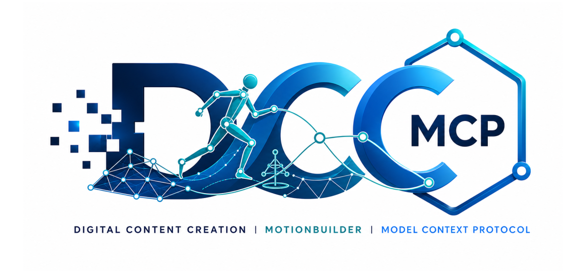

# dcc-mcp-mobu

<p align="center">
  
</p>

<!-- dcc-mcp-coverage-pointer:start -->
<!-- Generated from dcc-mcp-catalog.yml by scripts/generate_adapter_pointer.py in dcc-mcp/dcc-mcp-core. Do not edit by hand. -->
## Part of the DCC-MCP host matrix

**dcc-mcp-mobu** — Autodesk MotionBuilder adapter for DCC-MCP.

It is one of **38 host adapters** in the DCC-MCP catalog. Every adapter speaks the same
MCP protocol and builds on the same core runtime contract; each one exposes the tools
its own host needs on top of that.

- [All host adapters and install metadata](https://dcc-mcp.github.io/ecosystem)
- [Host matrix on the core README](https://github.com/dcc-mcp/dcc-mcp-core#readme)
- [Showcase](https://dcc-mcp.github.io/showcase)

This block is generated from the catalog entry in
[`dcc-mcp-catalog.yml`](https://github.com/dcc-mcp/dcc-mcp-core/blob/main/dcc-mcp-catalog.yml).
Re-run the generator after changing the catalog.
<!-- dcc-mcp-coverage-pointer:end -->

## Agent workflow

AI agents should use the shared gateway through `dcc-mcp-cli`; IDE users may
continue to use the MCP endpoint. Prefer typed skills and tools over raw scripts.

### Install or update the CLI

`dcc-mcp-cli` is the preferred control path for every shell-capable agent. If
it is missing, ask the user before installing the latest official release:

```bash
# Linux/macOS
curl -fsSL https://raw.githubusercontent.com/dcc-mcp/dcc-mcp-core/main/scripts/install-cli.sh | sh

# Windows PowerShell
powershell -ExecutionPolicy Bypass -c "irm https://raw.githubusercontent.com/dcc-mcp/dcc-mcp-core/main/scripts/install-cli.ps1 | iex"
```

Keep an official build current through the release manifest:

```bash
dcc-mcp-cli update check
dcc-mcp-cli update apply
```

`update apply` downloads and stages the latest CLI for the next launch. It
does not update a running `dcc-mcp-server`; update that server in its own
environment.

```bash
dcc-mcp-cli dcc-types
dcc-mcp-cli list
dcc-mcp-cli search --query "<task>" --dcc-type mobu
dcc-mcp-cli describe <tool-slug>
dcc-mcp-cli call <tool-slug> --json '{"key":"value"}'
```

`dcc-types` reports release-catalog support; `list` reports live sessions. If a
tool belongs to an inactive progressive skill, call `dcc-mcp-cli load-skill <skill-name> --dcc-type mobu` before retrying. For post-task improvement,
attach a stable session id with `--meta-json`, query `dcc-mcp-cli stats --range 24h --session-id <task-id>`, then pass the bounded evidence to the
`review_skill_improvement` prompt from `dcc-mcp-skills-creator`.


An MCP adapter for Autodesk MotionBuilder, built on [dcc-mcp-core](https://github.com/dcc-mcp/dcc-mcp-core).

It exposes a small, typed scene-management surface and runs MotionBuilder API calls on the application's UI thread.

## Install

Follow the [agent-first installation and lifecycle guide](install.md). It uses
MotionBuilder's exact `mobupy`, stages a receipted Startup hook, verifies a
typed host ping, and provides standard install/status/verify/uninstall/upgrade
commands. A system-pip install is not a MotionBuilder installation.

Each adapter instance uses an OS-assigned port and registers it for CLI discovery. Connect
through the stable gateway at `http://127.0.0.1:9765/mcp`; set `DCC_MCP_MOBU_PORT` only
when a fixed direct endpoint is required.

## Tools

- `mobu-scene.inspect_scene`
- `mobu-scene.list_models`
- `mobu-scene.save_scene`

`save_scene` is destructive and requires an explicit absolute `.fbx` path.

## Development

```bash
python -m pip install -e ".[dev]"
pytest
ruff check src tests tools
ruff format --check src tests tools
python tools/lint_skills.py
python -m build
```

## License

MIT
